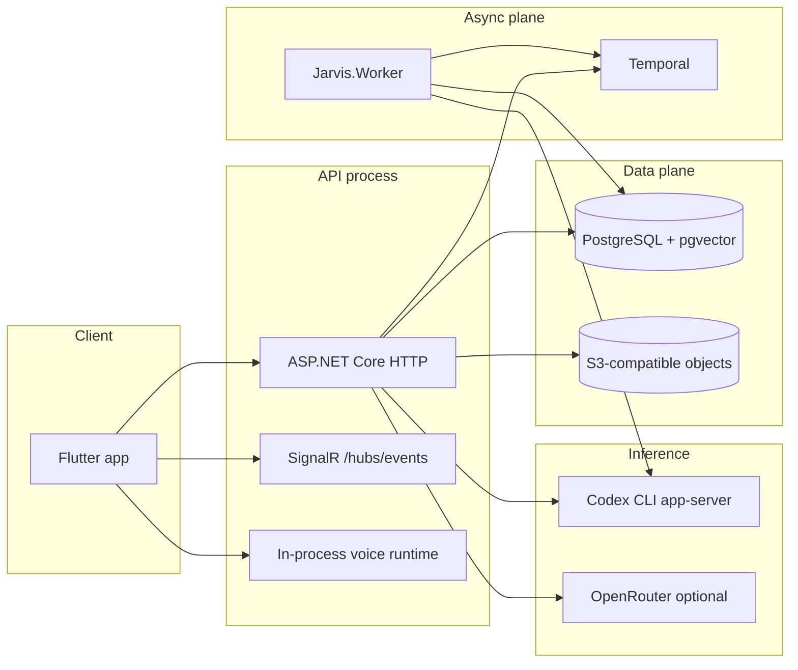

# Architecture overview

Jarvis is a **self-hosted personal assistant**: a modular **.NET monolith** (API + worker) with a **Flutter** client. Features are delivered in vertical slices; behavior is owner-scoped and designed for a single tenant or a small set of registered accounts on one deployment.

## Major runtime components

| Component | Role |
|-----------|------|
| **Jarvis.Api** | HTTP `/api/v1`, SignalR, voice bridge, webhooks (WhatsApp), A2A (`/a2a`), OpenAPI in Development |
| **Jarvis.Worker** | Temporal activities: reminders, watches, tasks, file indexing, heartbeat/dreaming, briefing |
| **Jarvis.AppHost** | .NET Aspire orchestration for local PostgreSQL, Temporal dev server, SeaweedFS, ClamAV, LiveKit, signal-cli |
| **apps/mobile** | Chat, tasks, memory, settings, voice (LiveKit), device node, channels |
| **PostgreSQL** | Conversations, identity, memory, files metadata, integrations (encrypted), audit, graph |
| **Object storage** | Private file blobs (Garage/SeaweedFS/S3) |
| **Temporal** | Durable schedules and long-running work with stable workflow IDs |
| **Codex CLI** | Primary model path via app-server JSON-RPC; OAuth session on host/container |

## Cross-cutting concerns

- **Owner scope**: Almost every row and API call is keyed by `OwnerId` (ASP.NET Identity user id in production; fixed dev owner when unauthenticated in Development).
- **Approvals**: Sensitive tool calls (MCP invoke, forget memory, browser navigation, coding, remote agents, etc.) go through `IToolApprovalStore` and resume after user decision.
- **Untrusted context**: Memory, file excerpts, task transcripts, web/search, and channel text are injected as reference data—not system instructions.
- **Telemetry**: OpenTelemetry via `Jarvis.ServiceDefaults`; prompts, tool args, and memory queries are excluded from spans.

## Feature domains (where code lives)

| Domain | Application (`Jarvis.Application`) | Agents (`Jarvis.Agents`) | API endpoints |
|--------|-----------------------------------|--------------------------|---------------|
| Conversations | `Conversations/` | `JarvisAgent`, compaction | `ConversationEndpoints` |
| Tasks / reminders / watches | `Workflows/` | `TaskAgentTools`, `ReminderAgentTools`, … | `AutomationEndpoints` |
| Memory / graph | `Memory/` (+ `Jarvis.Memory`) | `MemoryAgentTools`, graph contributors | `MemoryEndpoints`, graph in `PersonalAssistantEndpoints` |
| Skills / persona / profiles / learning | `Skills/`, `Persona/`, `Profiles/`, `Learning/` | matching contributors | `SkillEndpoints`, `PersonaEndpoints`, `ProfileEndpoints`, `LearningEndpoints` |
| Files | `Files/` | `FileAgentTools` | `FileEndpoints` |
| Integrations / MCP | `Integrations/` | `McpServerAgentTools`, `Jarvis.Mcp` | `IntegrationEndpoints` |
| Channels | `Channels/` | (delivery services) | `ChannelEndpoints` |
| Voice | `Realtime/` | `VoiceSessionContext` | `VoiceEndpoints` |
| Browser | `Browser/` | `BrowserAgentTools` | `BrowserEndpoints` |
| Devices / home | `Devices/`, `Home/` | `DeviceToolContributor` | `DeviceEndpoints`, `/home` |
| A2A / remote agents | `Agents/` (app) | `RemoteAgentToolContributor` | `A2AEndpoints` |
| Surfaces (generative UI) | `Surfaces/` | `SurfaceToolContributor` | `SurfaceEndpoints` |

## Related documents

- [layers-and-dependencies.md](layers-and-dependencies.md) — project graph and dependency rules
- [chat-agent-runtime.md](chat-agent-runtime.md) — turn lifecycle, Codex adapter, SignalR
- [security-and-ownership.md](security-and-ownership.md) — auth, data protection, fail-closed behavior
