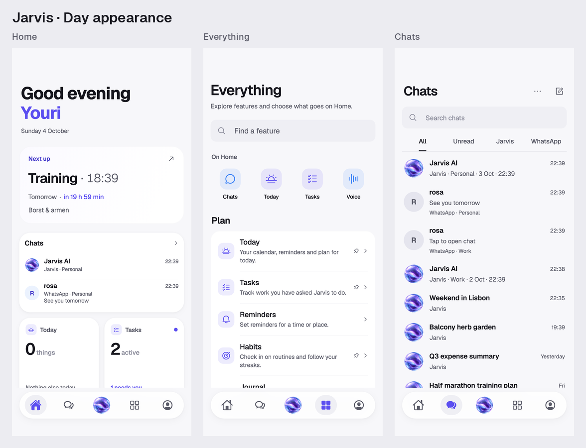
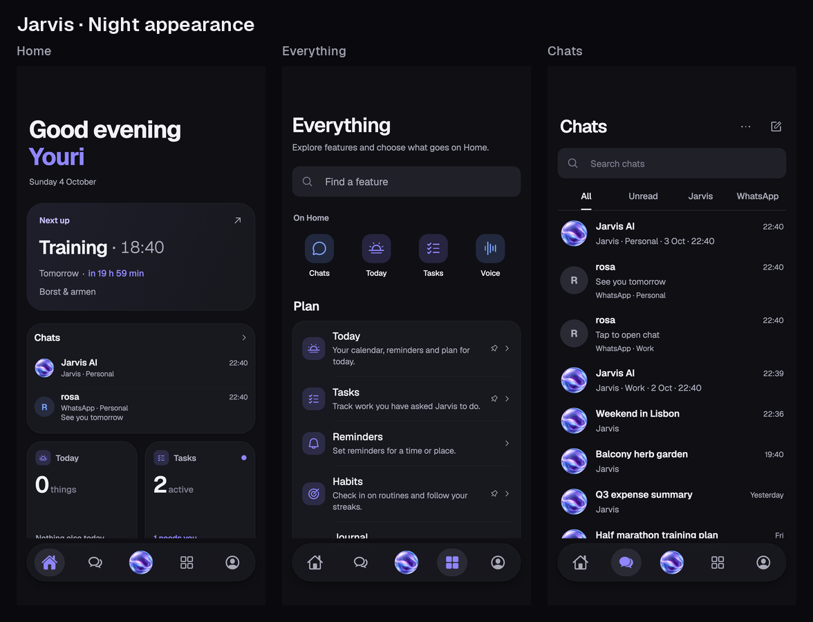
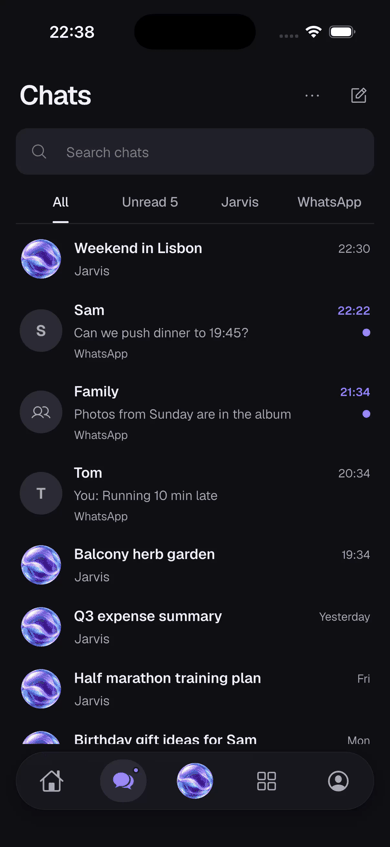

# UI review: Home, Chats and Everything

These previews use the actual Flutter app and local sample data, with the existing light and dark themes, Geist typography, Phosphor feature symbols and purple/blue Jarvis identity.

| Day | Night |
| --- | --- |
|  |  |



The recording shows Chats filters, tab navigation, feature sheet presentation, preview resizing and the Jarvis orb opening a conversation. Idle intervals are shortened; the interaction frames retain their original timing.

Run the app locally without a backend or account:

```sh
cd apps/mobile
flutter run -d <device> -t tool/ui_preview.dart
```

The preview entry point refuses release mode. Appearance can be changed through You → Appearance.

Regenerate the screen captures and verify four iPhone viewport widths (320, 375, 393 and 430 pt), both themes and 100%/200% text:

```sh
flutter test --no-pub test/screenshots/ui_polish.dart
```

Captures are written to `apps/mobile/build/screenshots/`. The day/night boards combine Home, Everything and Chats at 393 pt. Brand asset prompts and the optional app-icon master are in [`apps/mobile/assets/brand/README.md`](../../../apps/mobile/assets/brand/README.md).
